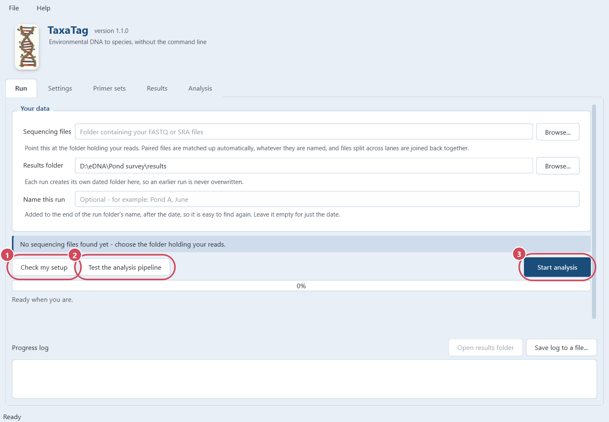
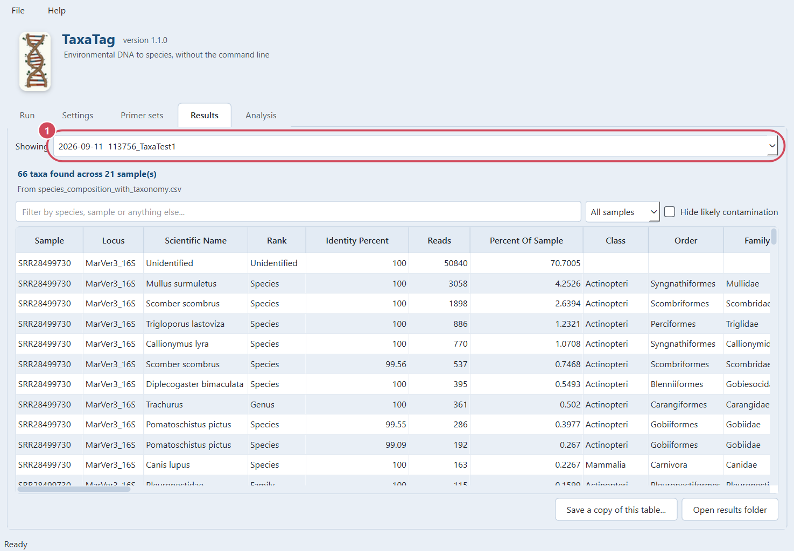
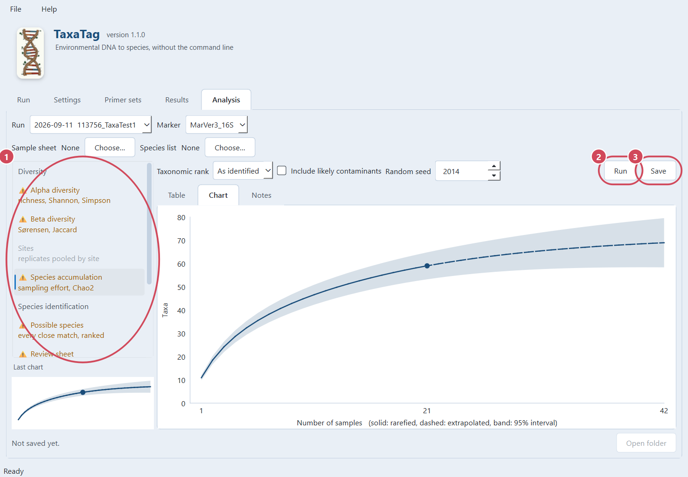
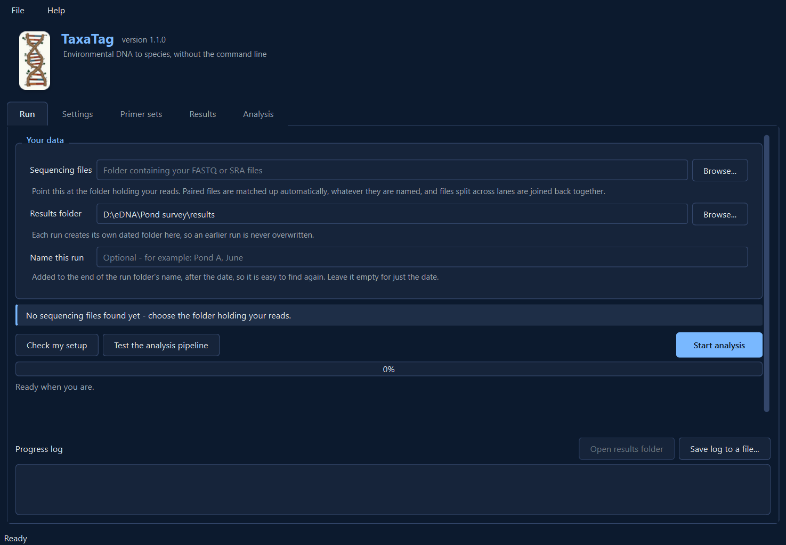

# TaxaTag

**Environmental DNA to species, without the command line.**

TaxaTag turns the sequencing files from an eDNA metabarcoding experiment into a
table of which species were found in which sample. Designed on Windows and coming to MacOS and Linux soon, TaxaTag is built for ecologists and geneticists who would rather avoid R and the Command Line while maintaining the same transparency and data quality.

**1** checks your files, tools and settings before anything runs. 
**2** analyses four bundled samples whose answers are known, so you can prove the installation works before trusting it with real data. 
**3** starts.

Metabarcoding analysis has generally meant a chain of command-line tools, a
Linux machine, and paths and thresholds edited into scripts by hand. TaxaTag
does the same science through a window, with every setting visible and
changeable, and with a reference library that identifies a whole survey
offline in seconds.

---

## What you would use it for

- Monitoring for **invasive species** in rivers, lakes or coastal water
- Confirming whether a **particular species is present** at a site
- Describing the **community** in a set of water or sediment samples
- **Before-and-after** surveys around a development, a restoration or a spill
- Teaching metabarcoding without giving a class a Linux terminal first

TaxaTag ships primers for the four markers most surveys use — **12S** and
**16S** for vertebrates, **COI** for invertebrates, **18S** for eukaryotic
plankton — and eleven published primer sets between them. You can add your own.

It is most useful where good reference sequences already exist for your
markers. Where they do not, TaxaTag will tell you it cannot name something
rather than guessing.

---

## What is different about it

| | |
|---|---|
| **Nothing is hidden** | Every threshold and path is in the window and in a settings file. If a reviewer asks why a sequence was kept, the answer is visible. |
| **It says when it does not know** | Where equally good references disagree, TaxaTag reports the rank they agree on — genus, or family — instead of picking the first hit and calling it a species. |
| **Each marker searches its own references** | A 12S read is never compared against COI, which removes a whole class of spurious match. |
| **It checks before it starts** | Inputs, tools and settings are all validated first. Failing in the first second beats failing forty minutes in. |
| **It works offline** | A local library identifies a survey in under a second, with no network and no dependence on a service staying up. |
| **It can prove it works** | A bundled self-test runs four samples with known answers, so you can confirm the installation is sound before trusting it with real data. |
| **It tells you about updates, and takes no for an answer** | If a newer version exists, TaxaTag says so once and offers to install it. "Don't ask again" applies to that version, not to updates forever. It never updates itself without being asked. |

---

## Getting started

### 1. Download it

Everything is on the [releases page](https://github.com/Rudie-K/TaxaTag/releases).

| | | |
|---|---|---|
| **Installer** | `TaxaTag-<version>-Windows-x64-Setup.exe` | Installs for you. No administrator password needed. |
| **Portable** | `TaxaTag-<version>-Windows-x64-portable.zip` | Unzip and run. Nothing is installed, nothing is written outside the folder. |

Take the **portable zip** if you are on a managed university or consultancy
laptop, or if you are unsure. It is the same program.

**What it needs:** Windows 10 or 11, 64-bit. About 450 MB for the program and
2 GB more if you take the reference library. 8 GB of memory is comfortable.
You require no administrator password, no existing Python or R, and nothing else to install —
Cutadapt, VSEARCH, NCBI BLAST+ and the SRA Toolkit are all inside the
download.

**On macOS and Linux** there is no packaged download yet. TaxaTag itself runs
on both — the tools it needs are bundled for all three systems — so you can
run it from the source folder today with `./taxatag.sh`on the command line, which sets itself up
on the first run. A packaged build for each is the next thing planned.

### 2. Check it works

Open TaxaTag and press **Test the analysis pipeline**.

It analyses four bundled samples whose answers are known and tells you whether
it got them right. It needs no data of yours and no reference library, and it
takes under a minute. This is the thing to run first on a machine where
nothing is set up yet — if it passes, the installation is sound.

### 3. Get a reference library

TaxaTag offers to download the **marine core** library the first time it
starts without one. It is 653 MB to download and about 2 GB installed, and it
covers 12S, 16S, COI and 18S.

Found here if app based installation fails - https://github.com/Rudie-K/TaxaTag-additional-content

You do not have to take it. Without a library TaxaTag searches NCBI over the
web instead, which works and is slower. The offer stays in the library list on
the *Run* tab if you would rather decide later.

### 4. Run your data

Point **Sequencing files** at the folder holding your reads. Choose a
**Results folder**. Press **Check my setup**, then **Start analysis**.

TaxaTag reads what comes off a sequencer or out of the SRA, as it arrives:

| | |
|---|---|
| `.fastq`, `.fastq.gz`, `.fq.gz` | the usual output of a sequencing run |
| `.sra`, or a bare accession folder | downloaded from the NCBI Sequence Read Archive |

Paired files are matched up automatically **whatever they are named** —
`_R1`/`_R2`, `_1`/`_2`. You do not need to rename anything.

**How long does it take?** TaxaTag estimates before you start: the line above the
buttons gives an estimate for the folder you have chosen, learned from runs
already measured on its installation, meaning the more runs, the more confident the estimation to your machine. 
As a rough guide, twenty samples against a local library is minutes rather than hours; 
the same twenty against NCBI over the web is considerably slower as it relies on external servers and is subject to shadow limits.

### 5. Read the results

Each run creates its own dated folder, so an earlier run is never overwritten.
Results open in the window, and any earlier run can be reopened from the
picker at **1**.

This is a real run: twenty-one water samples from the Sussex kelp Restoration Project, 16S,
against the marine core library. One sample's rows, as they come out:

| Scientific name | Rank | Identity | Reads | % of sample | Family |
|---|---|---|---|---|---|
| Unidentified | **Unidentified** | 100 | 50,840 | 70.7 | |
| *Mullus surmuletus* | Species | 100 | 3,058 | 4.25 | Mullidae |
| *Scomber scombrus* | Species | 100 | 1,898 | 2.64 | Scombridae |
| *Trigloporus lastoviza* | Species | 100 | 886 | 1.23 | Triglidae |
| *Callionymus lyra* | Species | 100 | 770 | 1.07 | Callionymidae |
| *Diplecogaster bimaculata* | Species | 100 | 395 | 0.55 | Gobiesocidae |
| *Trachurus* | **Genus** | 100 | 361 | 0.50 | Carangidae |
| *Pomatoschistus pictus* | Species | 99.55 | 286 | 0.40 | Gobiidae |

**"Trachurus" stops at genus.** Several horse mackerel species matched
equally well, and rather than pick the first and call it a species, TaxaTag
reports the rank they agree on. **"Unidentified"** is the same honesty
applied to a sequence nothing matched well enough to name. 
Both are visible in the table, both are counted, and neither is quietly dropped.

The file containing the results will be in its respective run folder as `05_results/species_composition.csv` 
one row per taxon, per sample, with the evidence beside it. The **"Save a copy of this table"** button writes
whatever you are looking at, optional filters included.

### 6. Analyse them

The **Analysis** tab turns a finished run into the summaries a species table
is usually taken elsewhere for. Choose an analysis from the list at **1** and
press **Run** at **2**. Nothing is written until you press **Save** at **3**,
which keeps the tables - and the chart, as a picture - in a dated folder
inside the run, with a note of exactly how they were made.

- **Diversity**: richness, Shannon and Simpson per sample; how different
  samples are from each other; replicates pooled into sites from your sample
  sheet; and whether sampling was enough, with a species accumulation curve.
- **Species identification**: every close match for each sequence, ranked;
  a review sheet listing each call with its evidence, for you to mark right
  or wrong in a spreadsheet; and, from that filled sheet, how accurate the
  names were at each rank.
- **Reference library**: which species on your list the library has no
  reference for, and so could never be named.

An analysis that cannot run on your data is greyed out, and says why when
you point at it or press Run; one that can but should be read with care is
marked with a warning sign. The curve above, for example, is marked because
this run was made with an older TaxaTag.

A species table is something you read for a long time. If a white window is
hard on your eyes, the **Display** group at the top of the Settings tab has a
dark scheme, three text sizes, and a dyslexia-friendly font; by default
TaxaTag follows whatever your computer is set to.

---

## Keeping it up to date

When a newer version exists, TaxaTag says so the next time it starts, and
offers three answers: install it now, be reminded next time, or skip this
version. **Skipping applies to the version on offer**, not to updates in
general, you will still be asked about future updates.

Choosing to update closes TaxaTag and runs the installer, which replaces the
existing installation rather than adding a second one. Your settings, results
and reference libraries are not touched.

Nothing is ever installed without being asked, and nothing is installed that
cannot be checked against the checksum published with it. If there is no
internet connection, TaxaTag says nothing at all.

Reference libraries are offered the same way when a newer one is published,
and are replaced without closing anything.

---

## The reference library

A reference library is what your sequences are compared against. TaxaTag uses
one BLAST volume per marker plus a catalogue giving the lineage of every
record, which is why a 12S read is only ever searched against 12S references.

The **marine core** covers fish, invertebrates and eukaryotic plankton across
all four markers — around 3 million sequences, built from MitoFish, MIDORI2,
BOLD, PR2 and the NCBI taxonomy. It is free, and TaxaTag can download it for
you by clicking the library option.

You can also build your own, extend the core with your own sequences, assign
an existing BLAST database. The *Run* tab's library list is where all of that is chosen.

---

## Help

Every setting in TaxaTag explains itself in the window, under the field it
belongs to. **Check my setup** names anything that would stop a run before it
starts, and **Test the analysis pipeline** proves the installation works on known data.

**If something goes wrong**, open an
[issue](https://github.com/Rudie-K/TaxaTag/issues) and say what you did, what
happened, and what you expected. **Help → About** shows the version and where
your settings file lives; both are worth including. **Save log to a file...**
on the *Run* tab writes everything TaxaTag printed during a run, which is
usually the fastest way to see what happened.

Bug reports are welcome through the GitHub **Issues** feature and so are requests. 
TaxaTag aims to be a continually improving asset for the environmental community.

---

## Licence

TaxaTag is free software under the **GNU General Public License, version 3**.
The full text is in [LICENSE](LICENSE).

You may use it for anything, including commercial work, and you may change and
redistribute it. The condition is that anyone you pass a copy to gets the same
freedoms and the source to go with it.

The bundled tools carry their own terms: VSEARCH is GPL-3/BSD,
Cutadapt is MIT, and NCBI BLAST+ and the SRA Toolkit are United States public
domain (correct as of 09/09/2026).

**The name and the logo are separate.** "TaxaTag" and its logo are not
covered by the GPL, and all rights in them are reserved. You are free to use
the name and show the logo whenever you are talking *about* TaxaTag: cite it,
link it, teach with it, put it on a slide or any other non-modifying purpose.
What the carve-out prevents is a *modified* version going out under this name and mark. 
As TaxaTag is a scientific program modified versions under its branding are not permitted unless explicitly granted.

**Reference data is separate.** A reference library is a dataset, not part of
this program, and the sources it is built from — MitoFish, MIDORI2, PR2, BOLD
and the NCBI taxonomy — each carry their own terms. Every library TaxaTag
builds or installs carries a `LICENCE-DATA.txt` saying what its contents
permit. Check it before passing a library on.

---

## Citing TaxaTag

If you use TaxaTag in published work, please cite it and the tools it is built on.

> Rudie Kauhanen, Lucy Thomas and Ruth Farrant. **TaxaTag: a localised open-source eDNA metabarcoding pipeline for non-bioinformaticians**, 2026.
